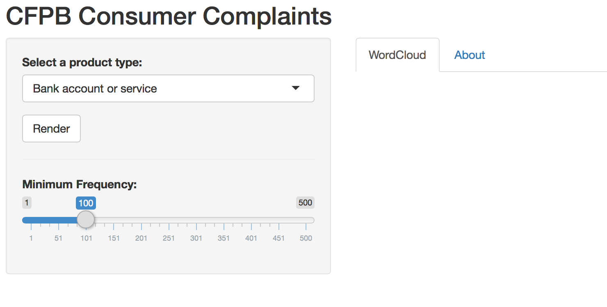
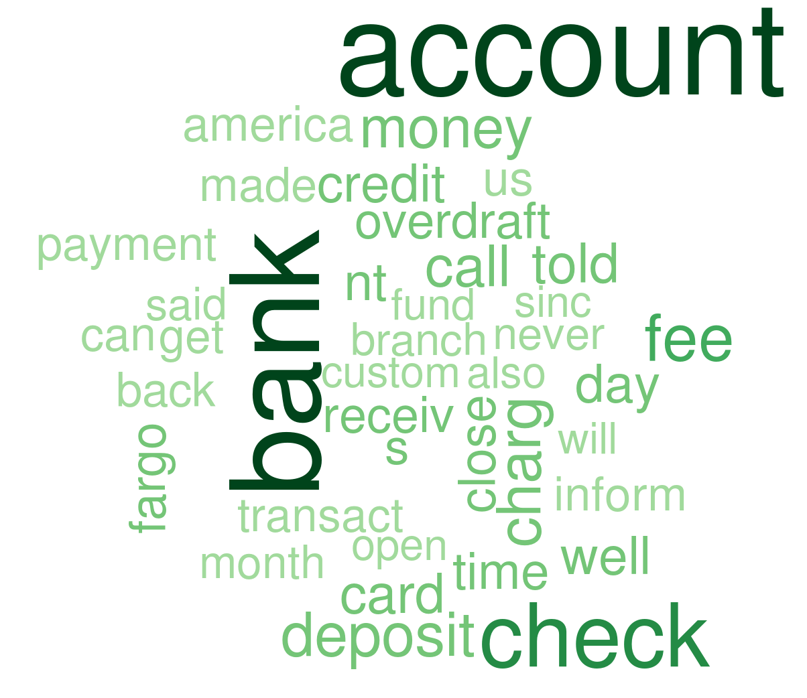

<!-- Limit image width and height -->

<!-- Center image on slide -->

## Consumer Financial Protection Bureau

The Consumer Financial Protection Bureau (CFPB) is a 21st century agency that helps consumer finance markets work by making rules more effective, by consistently and fairly enforcing those rules, and by empowering consumers to take more control over their economic lives. One way to take control of your financial life is to submit a complaint to the Office of Consumer Response. This office answers questions, handles complaints, and analyzes and shares data to level the consumer finance playing field.

If you have anissue with a financial product or service you can submit a complaint by visiting www.consumerfinance.gov/complaint

--- .class #id 

## Data

Consumer Response began accepting complaints in July 2011. My app was created using a subset of the databse - the most recent 2016 data. The whole database is publicly available at https://data.consumerfinance.gov/dataset/Consumer-Complaints/s6ew-h6mp . My word cloud will be made using the consumer complaint narratives from this database. Personal information has been removed and an example of what the dataset looks like is provided below.

|Date.received |Product          |Sub.product                           |Issue                                  |Sub.issue                            |
|:-------------|:----------------|:-------------------------------------|:--------------------------------------|:------------------------------------|
|02/16/2016    |Debt collection  |Payday loan                           |Communication tactics                  |Threatened to take legal action      |
|02/16/2016    |Debt collection  |I do not know                         |Communication tactics                  |Frequent or repeated calls           |
|02/16/2016    |Credit reporting |NA                                    |Incorrect information on credit report |Information is not mine              |
|02/16/2016    |Debt collection  |Medical                               |Cont'd attempts collect debt not owed  |Debt was paid                        |
|02/16/2016    |Debt collection  |Other (i.e. phone, health club, etc.) |Disclosure verification of debt        |Right to dispute notice not received |

--- .class #id 

##  Shiny App

The application allows you to select a product and render a word cloud with the narrative pertaining to that product type. Additionally, the user selects the minimum frequency of words to be included so more or less detailed graphics can be created.

--- .class #id 

##  Sample Word Cloud

Below is a sample word cloud that is created using the default parameters. 

